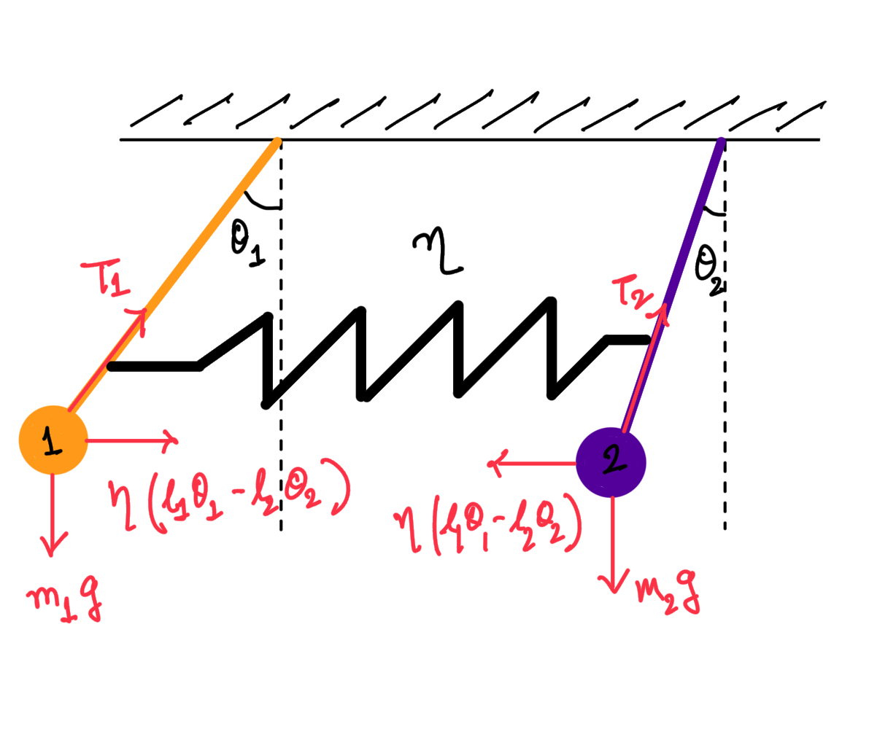

# Coupled Pendulums and the Mystery of Dark Matter  

Any student in a high school or undergraduate science lab has probably come across the **coupled pendulum** system. It’s a beautiful little experiment that looks simple but hides deep physics.  

Imagine two pendulums connected by a spring. If you flick one pendulum, it starts oscillating. After a while, the motion seems to fade away—only to show up in the other pendulum! Then, after some time, the energy flows back to the first one. This back-and-forth continues until friction eventually damps the motion in real life.  

<iframe width="560" height="315" 
  src="https://www.youtube.com/embed/63lGZYdfano" 
  frameborder="0" allow="accelerometer; autoplay; encrypted-media; gyroscope; picture-in-picture" 
  allowfullscreen>
</iframe>

Video credit: <a href="https://www.youtube.com/watch?v=63lGZYdfano" target="_blank">Original YouTube source</a>

Now you might ask: what does any of this have to do with **dark matter (DM)**? Surprisingly, quite a lot!  

---

## Step 1: The Physics of Coupled Pendulums  

As the ritual goes with any classical mechanics problem, let’s start with a **free-body diagram** for the two pendulums. 

  

  
### Variables
- $m_1, m_2$ — masses of pendulum 1 and 2  
- $l_1, l_2$ — lengths of the pendulum rods  
- $\theta_1, \theta_2$ — angular displacements of pendulum 1 and 2 (measured from vertical)  
- $\ddot{\theta}_1, \ddot{\theta}_2$ — angular accelerations of pendulum 1 and 2  
- $g$ — gravitational acceleration  
- $\eta$ — coupling constant, describing the restoring force due to the spring (or coupling) between pendulums  
- $\omega_1^2 = g/l_1$, $\omega_2^2 = g/l_2$ — natural squared frequencies of the uncoupled pendulums  

Applying Newton’s second law ($F = ma$), we can write down the equations of motion for pendulum 1 and 2.  

$$
m_1 l_1^2\ddot{\theta}_1 = -m_1 g l_1 \sin{\theta_1} - \eta(l_1 \sin{\theta_1} - l_2 \sin{\theta_2})
$$
$$
m_2 l_2^2\ddot{\theta}_2 = -m_2 g l_2 \sin{\theta_2} + \eta(l_1 \sin{\theta_1} - l_2 \sin{\theta_2})
$$

These equations can be neatly expressed in a matrix form, making the symmetry of the problem clearer. 

$$
\begin{pmatrix}
\ddot{\theta}_1 \\\\
\ddot{\theta}_2
\end{pmatrix}
=
\begin{pmatrix}
\omega_1^2-\eta & \eta \tfrac{l_2}{l_1} \\\\
\eta \tfrac{l_1}{l_2} & \omega_2^2-\eta
\end{pmatrix}
\begin{pmatrix}
\theta_1 \\\\
\theta_2
\end{pmatrix}
$$

If you’re worried about not knowing or forgotten linear algebra to solve such coupled systems, don’t sweat it! Instead of grinding through the math, here’s a visualization of the solution.  

  

    
    <figcaption style="font-size:12px; text-align:center; margin-top:0.5rem;">
      Coupled pendulum system with constant $l_1$ and $l_2$
    </figcaption>
  
 
As advertised the energy from pendulum 1 transfer to pendulum 2 periodically with the total energy of the system remaining constant of course.

---

## Step 2: Adding a Twist—A Changing Pendulum  

Now let’s make things more interesting. Suppose the length of pendulum 1, $l_1$, changes slowly with time, going from some initial length $l_i$ to a final length $l_f$ over a duration $T$. This means its **natural frequency** becomes time-dependent:  

$$\omega_1(t) \propto \frac{1}{\sqrt{l_1(t)}}.$$

You can imagine someone slowly letting out the string of pendulum 1 at a rate $\alpha$. We have also taken the spring constant $\eta$ to be small, in anticipation of the feeble interactions of DM with ordinary matter. Once again, we can write down similar equations of motion, and here’s what the solution looks like:  

  

    
    <figcaption style="font-size:12px; text-align:center; margin-top:0.5rem;">
      Coupled pendulum system with increasing $l_1$
    </figcaption>
  
 

The key observation: when the lengths of the two pendulums become equal ($l_1 = l_2$), the oscillations in pendulum 2 suddenly **grow rapidly**. In technical language, **energy is being transferred resonantly** from pendulum 1 to pendulum 2. The resonant condition is when  

$$\omega_1(t_\text{res}) = \omega_2,$$  

with $t_\text{res}$ marking the time at which resonance occurs.  

---

## Step 3: From Pendulums to Dark Matter  

Here’s the exciting part. Some dark matter candidates—such as **axions** and **dark photons**—can couple to light (ordinary photons).  

Think of it this way:  
- Oscillations of **pendulum 1** → **ordinary photons**  
- Oscillations of **pendulum 2** → **dark matter particles**  

In vacuum, photons are massless, zipping along at the speed of light with refractive index $n = 1$. But in a medium, photons acquire an **effective mass**—equivalent to the refractive index shifting away from 1. As the photon moves through regions where the medium’s properties (density, temperature, etc.) vary, this effective mass evolves, just like $\omega_1(t)$ evolved with the changing pendulum length.  

At the special point when the photon’s effective mass matches the mass of the dark matter particle—  

$$m_\gamma(t) = m_\text{DM},$$  

—energy transfers **resonantly** between photons and dark matter and *voila* you have created **dark matter out of light!** 
You can carry out the exact same logic with  

- Oscillations of **pendulum 2** → **ordinary photons**  
- Oscillations of **pendulum 1** → **dark matter particles** 

thereby creating **light out of dark matter!**

---

## Step 4: Why This Matters  

This **photon–dark matter interconversion** is a central theme of my research. If dark matter particles can turn into light, we can look for **unexpected light signals** in telescopes and detectors. Conversely, if photons disappear by converting into dark matter, we can search for **missing signals** that shouldn’t vanish.  

This framework has already given us some of the **world’s leading constraints** on dark matter, and I believe it has the power to reveal even more. For more details checkout [my research](../research/index.md) page.

---

**In short:** the humble coupled pendulum experiment you might play with in school is more than a neat demo—it’s a window into how physicists are probing one of the biggest mysteries of the universe: the nature of dark matter.  
