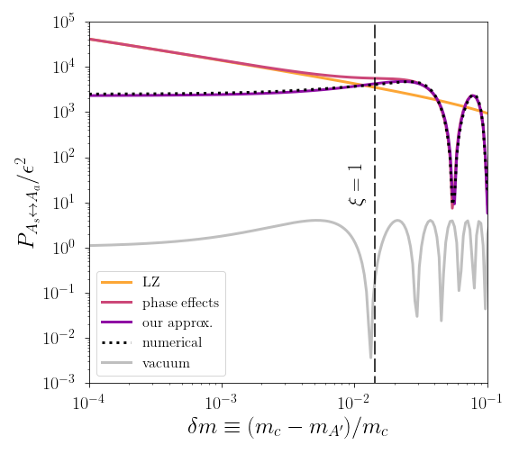
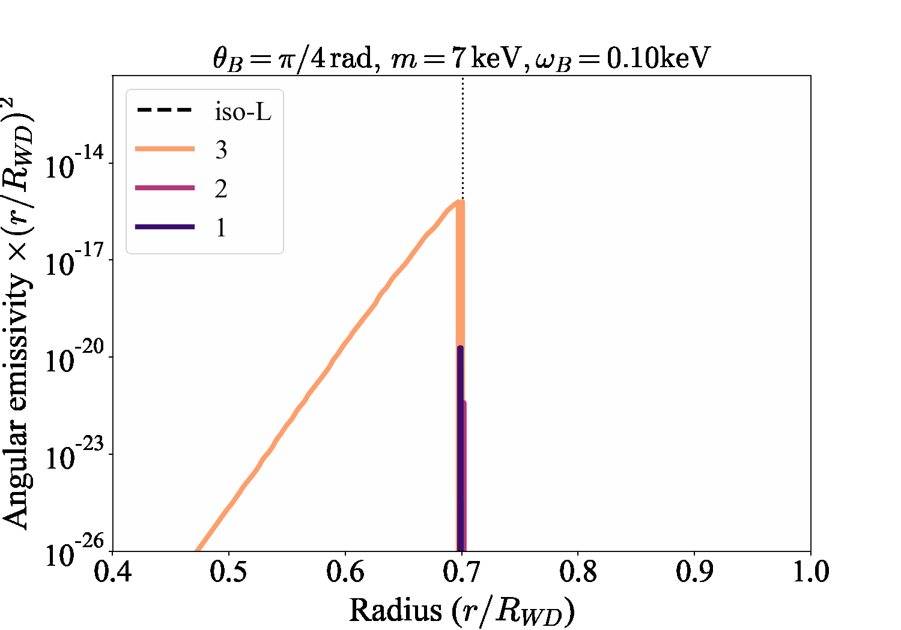
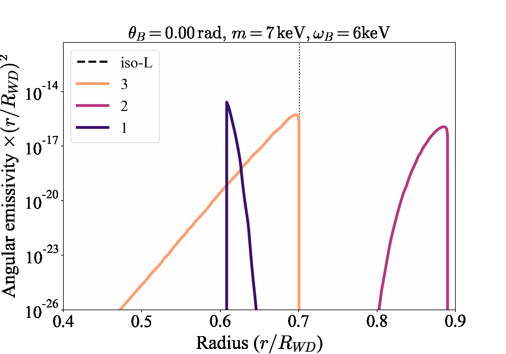
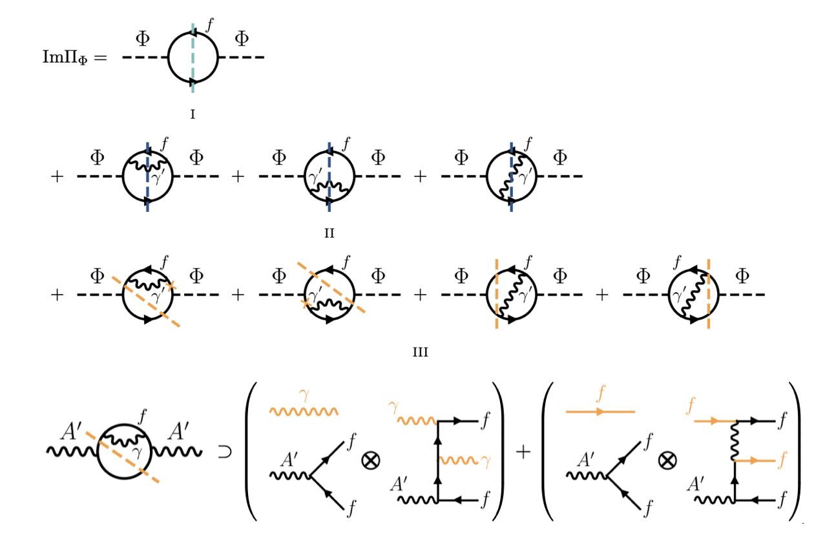
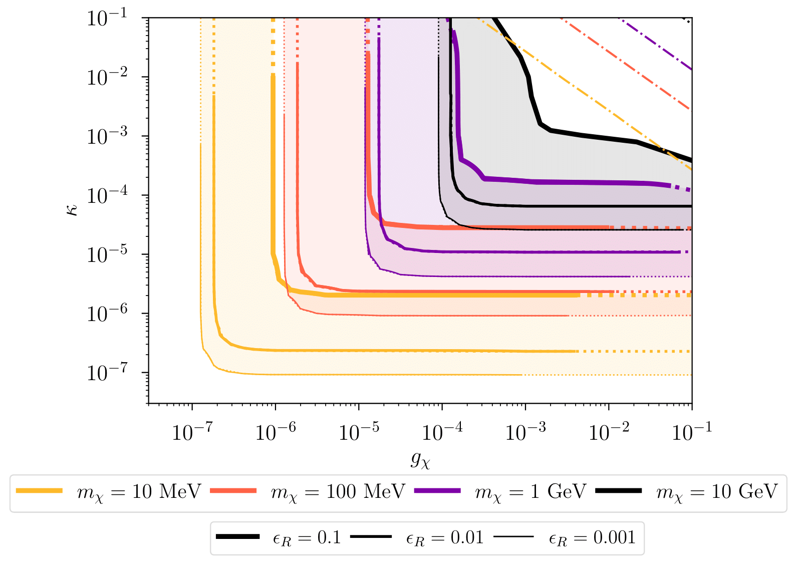

<blockquote>
  <a href="https://inspirehep.net/authors/2664905" target="_blank">
    A full list of publications
  </a>
</blockquote>

# Research

## Overview

For nearly a century, scientists have been puzzled by a cosmic mystery: DARK MATTER. We know it's there because of its powerful gravitational pull, shaping galaxies and the entire universe, but its true nature remains one of the biggest unanswered questions in physics. Nothing in the known Standard Model (SM) of elementary particles accounts for such elusive matter. **So what is it made of? And how does it interact with the world we can see (which is the SM)?**

My research aims to solve this enigma by exploring how dark matter (DM) and other exotic particles from a hidden sector behave in some of the universe's most extreme environments. I study how dark-sector particles (let me call them $X$) interact with the blazing-hot, super-dense matter and radiation found in stars, neutron stars, and the early universe. These cosmic crucibles act as natural laboratories, amplifying subtle interactions and providing us with powerful clues.
Inverting the perspective, I also investigate how a background of dark matter could subtly alter the behavior of ordinary matter. By looking for these faint imprints it is possible to open new windows into the dark sector. By developing new theoretical tools and applying them to real-world observations and experiments, my work bridges the gap between theory and observation, bringing us closer to uncovering the secrets of our hidden universe.

---

## Recent Highlights

### Resonant $X \leftrightarrow SM$ Conversions in Astrophysics

Certain hidden $X$ particles, such as axions and dark photons, can interconvert with photons when traveling through astrophysical media. This conversion is resonantly enhanced when the effective photon mass in a plasma matches the particle’s mass. Such resonant processes already provide some of the strongest existing limits on hidden sectors. My work resolves key gaps in conventional treatments of this conversion process, enabling sharper interpretation of current data and more reliable guidance for future discoveries.

#### Inhomogeneous Media

  

    Astrophysical environments are rarely uniform. As hidden particles traverse regions with varying density, temperature or magnetic fields, they may encounter multiple resonances. Standard methods, such as the <a href="https://en.wikipedia.org/wiki/Landau–Zener_formula" target="_blank">Landau Zener</a> (LZ) approximation, fail here because they neglect interference between successive resonances. I developed a new analytic expression that captures these interference effects, leading to more accurate predictions in environments such as the solar corona, intergalactic medium, and neutron star magnetospheres.  
    
   
<em>Relevant publications:</em> 
    <a href="https://arxiv.org/abs/2308.08586" target="_blank">
    N. Brahma, A. Berlin, K. Schutz, Photon–dark photon conversion with multiple level crossings, Phys. Rev. D 108 (2023) 9, 095045
    </a>
    

  

  

    

      
      <figcaption style="font-size:12px; text-align:center; margin-top:0.5rem;">
        Conversion probability versus resonance separation. Standard Landau–Zener estimates can be off by orders of magnitude when resonances are close; our analytic expression captures the interference effects accurately.
      </figcaption>
    

  

#### Anisotropic Media

  

    Magnetic fields and other anisotropies modify photon dispersion, shifting the conditions for resonant conversion and introducing directional effects. I constructed a framework, based on thermal field theory, that describes how magnetic fields alter both resonant and off-resonant conversion rates. This provides a more realistic description of hidden $X$ particle  production from plasmon collective modes in magnetized environment, which are common in astrophysical systems.
  

##### Magnetic white dwarfs

  

    Applying this framework to magnetic white dwarfs has revealed striking new effects. Interiors of magnetic white dwarfs can house immensely strong magnetic fields, exceeding $10^9$ Gauss (over billion times stronger than Earth!). In such strongly magnetized plasma, hidden-particle emission becomes strongly directional and resonant conversion can occur even in regions where it would be kinematically forbidden in an isotropic plasma. For axions, this magnetically induced resonant emission far exceeds the standard Primakoff or bremsstrahlung channels. These studies establish the potential for these magnetic field effects to offer a powerful, new lens to probe the dark sector.
  

<em>Relevant publications:</em> 
<a href="https://arxiv.org/abs/2410.14771" target="_blank">
N. Brahma & K. Schutz, Photon conversion to axions and dark photons in magnetized plasmas: a finite-temperature field theory approach, JHEP 12 (2024) 191 
</a> 
<a href="https://arxiv.org/abs/2509.07085" target="_blank">
N. Brahma, E. Iles, H. Schérer, K. Schutz, Resonant axion and dark photon production in magnetic white dwarfs, arXiv: 2509.07085 [hep-ph] 
</a>

  

    
    <figcaption style="font-size:12px; text-align:center; margin-top:0.5rem;">
      Emissivity for different magnetic field strengths from the three plasmon modes.
    </figcaption>
  

  

    
    <figcaption style="font-size:12px; text-align:center; margin-top:0.5rem;">
      Emissivity for different orientations of the magnetic field from the three plasmon modes.
    </figcaption>
  

---

### Dark Matter Production in Hot and Dense Media at Multi-Loop

  

    From stellar cores to the early universe, hot and dense plasmas drive the production of dark sector particles, offering unique windows into new physics. Most existing studies approximate these production rates using simplified Boltzmann equation calculations, which can be off by large factors compared to full thermal field theory results based on the imaginary part of the self energy. My approach provides a systematic diagrammatic mapping of multi-loop self-energies onto thermally weighted tree-level rates, revealing new interference effects that had been missed before. This work offers a practical, modular prescription for in-medium production, making accurate in-medium rate calculations accessible without requiring full thermal field theory machinery.

    
<em>Relevant publications:</em> 
      <a href="https://arxiv.org/abs/2507.14277" target="_blank">
      N. Brahma, S. Heeba, H.Schérer, K. Schutz, Spectral Surgery in a Heat Bath: a finite-temperature guide to particle production for phenomenologists,  arXiv: 2507.14277 [hep-ph]
      </a>
      

  

  

    

      
      <figcaption style="font-size:12px; text-align:center; margin-top:0.5rem;">
        Orange lines indicate interference contributions from asymmetric cuts of the two-loop self-energy, which are absent in conventional treatments.
      </figcaption>
    

  

---

### Resonant Inelastic Dark Matter — a Viable Sub-GeV Thermal Target

  

    Thermal relics with a small mass splitting (pseudo-Dirac or “inelastic” dark matter) coupled through a kinetically mixed dark photon are an important benchmark for sub-GeV dark-sector searches. Normally, the slightly heavier excited state must be depleted before recombination to satisfy CMB bounds. But in the resonant regime — when the dark-photon mediator mass is just above twice the dark-matter mass — this is not required. The resonance reduces the annihilation coupling at freeze-out, allowing a non-negligible excited-state population at recombination without violating CMB bounds. Because the excited state can survive to late times in this regime, the model predicts observable signatures that are usually suppressed in standard inelastic scenarios: late-time annihilation (indirect searches), exothermic scattering or upscattering (direct detection), and modified self-interaction phenomenology. Together, these effects reopen a broad region of sub-GeV parameter space as a realistic thermal target for upcoming experiments.

    
<em>Relevant publications:</em> 
    <a href="https://arxiv.org/abs/2308.01960" target="_blank">
    N. Brahma, S. Heeba, K. Schutz, Resonant pseudo-Dirac dark matter as a sub-GeV thermal target, Phys.Rev.D 109 (2024) 3, 035006
    </a>
    

  

  

    

      
      <figcaption style="font-size:12px; text-align:center; margin-top:0.5rem;">
        Viable small coupling values reproducing the observed DM relic density for different masses ($m_\chi$) of
